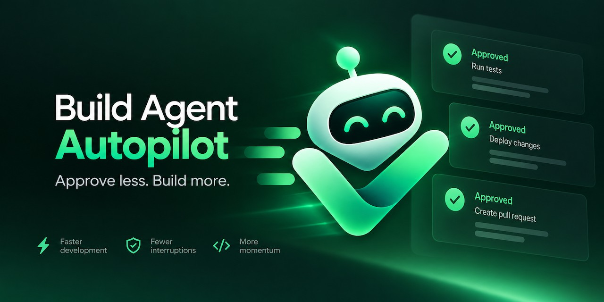

<p align="center">
  
</p>

<h1 align="center">Build Agent Autopilot</h1>

<p align="center">Chrome extension (Manifest V3) that approves recognised ServiceNow Build Agent checkpoints so a POC build keeps running without you watching it.</p>

## Install

1. Open `chrome://extensions`, switch on **Developer mode**.
2. **Load unpacked** → select this folder.
3. Pin the extension.

## Use

1. Open Build Agent on your instance and start a build.
2. Click the extension → **Enable on this instance** (once per instance).
3. Click **Start autopilot**.
4. The first time each kind of checkpoint appears, autopilot pauses and notifies you. Click **Always approve** to trust it and resume.

### When autopilot misses an approval

- **It paused on a button it wasn't sure about.** Any chat button starting with Approve, Accept, Confirm, Proceed, Continue or Allow is treated as a possible checkpoint. Click **Always approve** to learn it, or **Not a checkpoint** to ignore it from now on.
- **It didn't notice the button at all.** Click **Teach a button**, then click that button in Build Agent yourself. Your click approves it this time; autopilot approves it from then on. Teach mode lasts 60 seconds and only accepts buttons inside the chat.

Buttons containing words like Reject, Delete, Cancel, Discard or Stop are never learned or clicked.

### Sharing learnings

Click **Import / export** in the popup (next to **Trusted**) to open the learnings page.

- **Export** saves your trusted checkpoints, learned buttons and ignored buttons as a JSON file. Instance names and the activity log are not included.
- **Import** shows what a file adds before anything changes, then adds it to your learnings or replaces them. Anything doubtful is skipped with a reason: destructive button text, selectors that aren't a plain `tag.class` and malformed entries.

Only import files from people you trust: autopilot approves what they contain without asking.

Autopilot pauses and notifies when it sees:

- a checkpoint you haven't trusted yet, including unfamiliar approval-like buttons
- a sub-agent that fails after you clicked Start
- an Approve click the page doesn't react to within 60s
- the approval limit (default 25 per Start/Resume)

It also notifies, without pausing, after 5 minutes with no activity (finished, or waiting for your answer). If the page reloads while autopilot is watching (for example when a build finishes), it reconnects automatically and keeps its approval count. If it was paused, a reload stops it.

## How it finds checkpoints

The background worker injects the content script into the top frame on Start, and again after each reload while the run is active. It only injects on instances you enabled, but needs host permission for `https://*.service-now.com/*` to re-inject without a click. It walks the same-origin iframes and open shadow roots every 1.5s and looks for:

```
document > iframe > iframe > chat-view#shadow > chat-message#shadow > tool-use#shadow > button.approve-btn
document > iframe > iframe > chat-view#shadow > chat-message#shadow > planning-display#shadow > button.plan-btn.approve
```

Plans are always labelled `Plan`, so trusting one trusts all plans. Tool approvals are labelled with the first visible line of the `tool-use` card. Reject/Revise buttons are never touched.

Buttons you learn are stored as rules (`component`, `selector`, `text`) in `chrome.storage.local` and only match inside `chat-view`.

## Contributing checkpoints

Learned a button that others will hit too? Click **Report** next to it in the popup. That opens a pre-filled [New checkpoint](../../issues/new?template=new-checkpoint.yml) issue with only the rule: no plan text, requirements or instance names. You review it before submitting.

Rules reported by several people are added to `CHECKPOINTS` in `content.js` in the next release.

## Test

```sh
python3 -m http.server 8765 &
playwright-cli open && playwright-cli goto http://localhost:8765/test/fixture.html
playwright-cli eval "async () => { while (!window.__done) await new Promise(r => setTimeout(r, 500)); return window.__done }"
```

`test/fixture.html` rebuilds the observed DOM shape (`test/build-agent-dom.js`) and runs `content.js` against it with a stubbed `chrome` API. `test/learnings.html` checks import/export validation the same way.

## License

MIT
